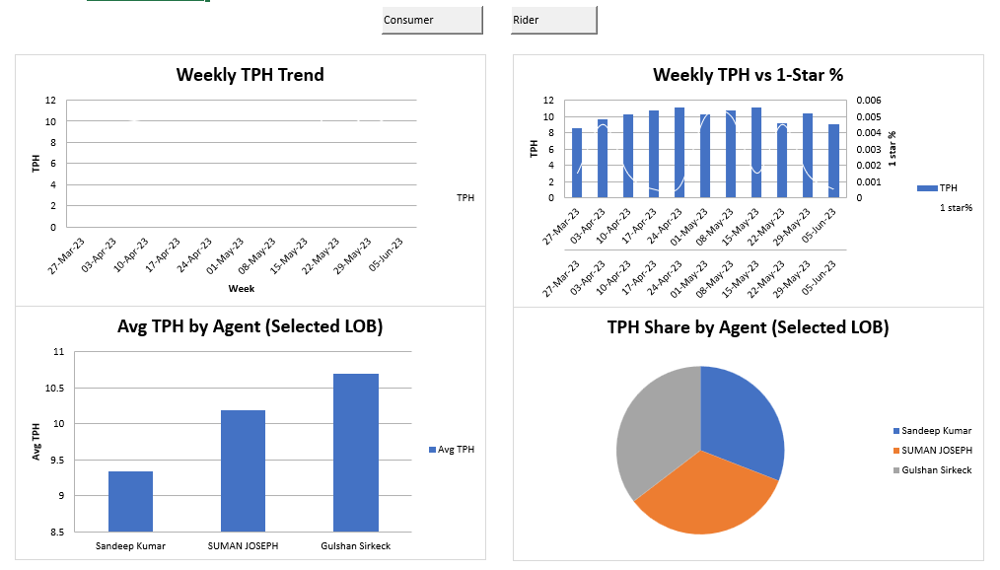
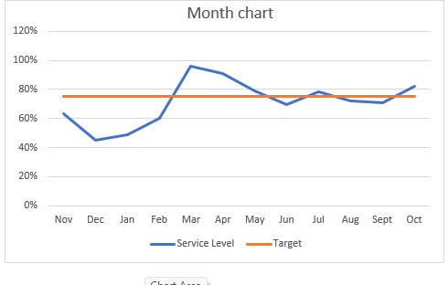
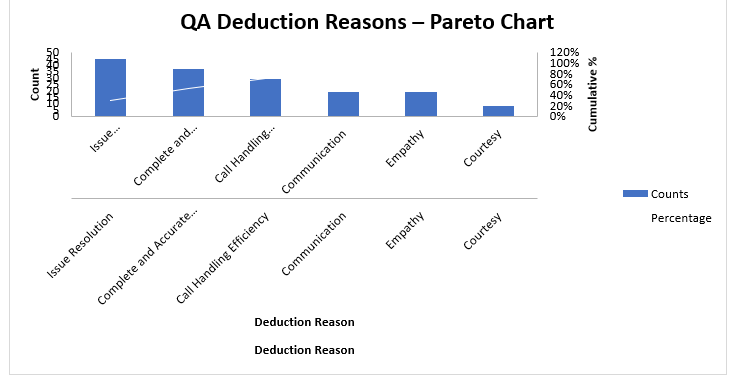

# 📊 wfm-staffing-formulas-qa-charts-dashboard
> Advanced Excel & VBA-driven workforce management toolkit — combining formula engineering, statistical charting, and macro-controlled executive dashboards for a multi-client contact centre.

This project demonstrates end-to-end Excel BI capability: complex formula logic (SUMPRODUCT, INDIRECT+MATCH, XLOOKUP), capacity & staffing math (FTE, Attrition, Concurrency), statistical quality charts (Pareto, Run Chart, Histogram), and a fully interactive, macro-controlled multi-chart dashboard.

---

## 🖼️ Dashboard Previews

---

## 📌 Business Scenario & Objective

A multi-client contact centre needed a single Excel workbook proving **BI-analyst-level command over formulas, statistical charting, and interactive dashboarding** — the exact toolkit used to track staffing, quality, and service-level performance in a live WFM environment.

**Goal:** Solve real staffing/costing formula problems, build statistical quality-control charts, and deliver a macro-driven executive dashboard that a business user can filter without touching a single formula.

---

## 📈 Key Metrics Computed

| Metric | Value | Technique Used | Business Relevance |
| :--- | :--- | :--- | :--- |
| **Original Item Price** | ₹41.94 | Reverse profit-margin formula | Cost-price derivation from selling price & margin% |
| **Attrition %** | 12.12% | `(Attriting Count / Opening HC)` | Core HR/WFM staffing health metric |
| **Closing Headcount** | 18 | Opening + Moved In − Attrition | Monthly headcount reconciliation |
| **FTE Required** | 360.27 vs 500 available | Forecast × AHT ÷ (weekly hrs × concurrency × (1−shrinkage)) | Staffing gap/surplus visibility |
| **Capacity** | 69,392 | FTE-based capacity formula | Max servable volume at current staffing |
| **Answer via SUMPRODUCT** | 67.98 | `SUMPRODUCT(Calls, AHT) / SUM(Calls)` | Weighted-average AHT across volume bands |

---

## 🛠️ Task-by-Task Breakdown

| # | Task | Excel Technique | Outcome |
| :--- | :--- | :--- | :--- |
| 1 | Reverse-calculate original price from profit% | Algebraic formula (`SP / (1+profit%)`) | ₹41.94 derived correctly |
| 2 | Attrition HC & Attrition % | Basic HC reconciliation formula | 12.12% attrition flagged |
| 3 | Weighted-average AHT | `SUMPRODUCT` | Single formula replacing multi-step calc |
| 4 | QA Deduction root-cause chart | Pareto Chart (bar + cumulative % line) | **Issue Resolution** & **Accuracy** identified as top deduction drivers |
| 5 | Process stability check | Run Chart | Visual trend/outlier detection over time |
| 6 | Distribution analysis | Histogram | Frequency spread of a QA/AHT metric |
| 7 | Dynamic lookup across sheets | `INDIRECT` + `MATCH` | Sheet-agnostic dynamic referencing |
| 8 | Modern lookup | `XLOOKUP` | Cleaner, more robust alternative to VLOOKUP |
| 9 | Staffing capacity model | FTE & Capacity formulas | Staffing gap of ~140 FTEs surfaced |
| 10 | Interactive weekly dashboard | Line + Combo + Bar + Pie charts, **VBA macro buttons for LOB filter (Consumer/Rider)** | One-click, no-formula-touch executive view |

---

## 💡 Key Insight from the Dashboard

> **Service Level breached target (75%) sharply in March (~96%)** then trended back down toward target by mid-year — visible only because the Run/Trend chart plots Service Level against a fixed Target line rather than in isolation.

> **QA Pareto shows "Issue Resolution" and "Complete & Accurate" handling as the top two deduction reasons**, together accounting for the majority of quality-score loss — the classic 80/20 pattern a Pareto chart is built to expose.

---

## ⚙️ Project Implementation & Methodology

**1. Formula Engineering**
| Requirement | Formula Pattern |
| :--- | :--- |
| Reverse cost-price | `=SellingPrice/(1+Profit%)` |
| Attrition % | `=AttritingCount/OpeningHC` |
| Weighted AHT | `=SUMPRODUCT(CallsRange,AHTRange)/SUM(CallsRange)` |
| Dynamic cross-sheet lookup | `=INDEX(Range,MATCH(Value,INDIRECT("SheetName!Range"),0))` |
| Modern lookup | `=XLOOKUP(Value,LookupArray,ReturnArray)` |
| FTE required | `=(Forecast*AHT)/(PerFTEWeeklyHours*3600*Concurrency*(1-Shrinkage))` |
| Capacity | `=FTE*PerFTEWeeklyHours*3600*Concurrency*(1-Shrinkage)/AHT` |

**2. Statistical Quality Charts**
- **Pareto Chart:** Ranked bar + cumulative % secondary axis to isolate the "vital few" QA deduction reasons
- **Run Chart:** Time-ordered line plot to catch shifts/trends invisible in a static average
- **Histogram:** Bin-based frequency distribution for spread and skew analysis

**3. Macro-Controlled Interactive Dashboard**
- VBA buttons (`Consumer` / `Rider`) dynamically re-filter all four charts from one control — no slicer or manual filter needed
- Combines **Line (trend)**, **Combo (dual-axis volume vs quality)**, **Bar (agent comparison)**, and **Pie (share of volume)** in a single view

---

## 📁 Repository Files

* 📊 `BI_Analyst_WFM_TP.xlsm`: Complete workbook — formulas, Pareto/Run/Histogram charts, and macro-driven dashboard
* 🖼️ `graphical_presentation_dashboard.png`, `service_level_vs_target.png`, `qa_deduction_pareto_chart.png`: Dashboard preview images
* 📝 `README.md`: Project overview, methodology, and key insights
* 
